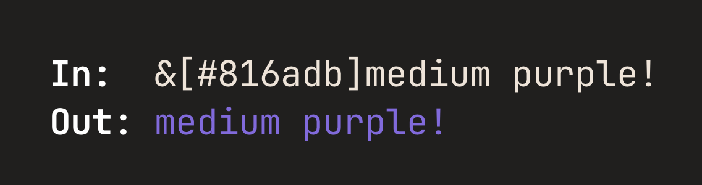

# Dahlia Specification

- [Introduction](#introduction)
- [Syntax](#syntax)
  - [Basic formatting](#basic-formatting)
  - [Custom colors](#custom-colors)
  - [Background colors](#background-colors)
  - [Escaping](#escaping)
- [Formatting Reference](#formatting-reference)
  - [ANSI Templates](#ansi-templates)
  - [ANSI Color Codes](#ansi-color-codes)
  - [ANSI Style Codes](#ansi-style-codes)
  - [ANSI Reset Codes](#ansi-reset-codes)
- [API](#api)
  - [Utility functions](#utility-functions)


## Introduction

`Welcome to &1Dahlia&r!` → `Welcome to \x1b[34mDahlia\x1b[0m!`

This document describes the specification for implementing the Dahlia library
in certain languages.

The key words "MUST", "MUST NOT", "REQUIRED", "SHALL", "SHALL NOT", "SHOULD",
"SHOULD NOT", "RECOMMENDED", "MAY", and "OPTIONAL" in this document are to be
interpreted as described in [RFC 2119](https://tools.ietf.org/html/rfc2119).


## Syntax

### Basic formatting
Dahlia formatting is done by using a marker (`&` by default) and codes 
(either [color](#ansi-color-codes) or [style](#ansi-style-codes)) from the list below.
All codes are 1-character long.


### Custom colors
Any color can be used by using the `&[#XXXXXX]` syntax, where `XXXXXX` is a
6-digit hexadecimal code. Short codes like `&[#FFF]` are not allowed.



### Background colors
All colors can be applied to the background instead of the text by appending a `~`
to the marker. For instance, `&~4` sets a red background.


### Escaping

The underscore serves as an escape code for Dahlia: `&_` gets converted to `&`.


## Formatting Reference

### ANSI Templates

Category      | Foreground           | Background
---           | ---                  | ---
text styles   | `ESC[{}m`            | `ESC[{}m`
3-bit colors  | `ESC[{}m`            | `ESC[{}m`
4-bit colors  | `ESC[{}m`            | `ESC[{}m`
8-bit colors  | `ESC[38;5;{}m`       | `ESC[48;5;{}m`
24-bit colors | `ESC[38;2;{};{};{}m` | `ESC[48;2;{};{};{}m`


### ANSI Color Codes

Name       | Dahlia | ANSI 3-bit | ANSI 4-bit | ANSI 8-bit | RGB             | HEX
:---       | :---:  | :---:      | :---:      | :---:      | :---:           | :---
Black      | 0      | 30         | 30         | 0          | (0, 0, 0)       | #000000
Blue       | 1      | 34         | 34         | 19         | (0, 0, 170)     | #0000aa
Green      | 2      | 32         | 32         | 34         | (0, 170, 0)     | #00aa00
Cyan       | 3      | 36         | 36         | 37         | (0, 170, 170)   | #00aaaa
Red        | 4      | 31         | 31         | 124        | (170, 0, 0)     | #aa0000
Purple     | 5      | 35         | 35         | 127        | (170, 0, 170)   | #aa00aa
Orange     | 6      | 33         | 33         | 214        | (255, 170, 0)   | #ffaa00
Light gray | 7      | 37         | 37         | 248        | (170, 170, 170) | #aaaaaa
Gray       | 8      | 30         | 90         | 240        | (85, 85, 85)    | #555555
Light blue | 9      | 34         | 94         | 147        | (85, 85, 255)   | #5555ff
Lime       | a      | 32         | 92         | 83         | (85, 255, 85)   | #55ff55
Turqoise   | b      | 34         | 96         | 87         | (85, 255, 255)  | #55ffff
Light red  | c      | 31         | 91         | 203        | (255, 85, 85)   | #ff5555
Pink       | d      | 35         | 95         | 207        | (255, 85, 255)  | #ff55ff
Yellow     | e      | 33         | 93         | 227        | (255, 255, 85)  | #ffff55
White      | f      | 37         | 97         | 15         | (255, 255, 255) | #ffffff


### ANSI Style Codes

Name          | Dahlia | ANSI
:---          | :---:  | :---:
Hidden        | h      | 8
Inverse       | i      | 7
Dim           | j      | 2
Blinking      | k      | 5
Bold          | l      | 1
Strikethrough | m      | 9
Underline     | n      | 4
Italic        | o      | 3


### ANSI Reset Codes

Reset kind    | Dahlia | ANSI
:---          | :---:  | :---:
Full          | `R`    | 0
Foreground    | `r#`   | 39
Background    | `r~`   | 49
Hidden        | `rh`   | 28
Inverse       | `ri`   | 27
Dim           | `rj`   | 22
Blinking      | `rk`   | 25
Bold          | `rl`   | 22
Strikethrough | `rm`   | 29
Underline     | `rn`   | 24
Italic        | `ro`   | 23


## API

For object-oriented languages (and those capable of implementing an equivalent
model, e.g. Rust with `struct` + `impl`):
```ts
enum Depth {
    TTY = 3,
    LOW = 4,
    MEDIUM = 8,
    HIGH = 24
}
type DepthString = "tty" | "low" | "medium" | "high"
type DepthInt = 3 | 4 | 8 | 24


class Dahlia {
    constructor(
        depth: Depth | DepthString | DepthInt = Depth.LOW,
        no_reset: boolean = false,
        no_color: boolean? = null,
        marker: char = '&'
    ) {}

    convert(str: string): string {}
    input(prompt: string): string {}
    print(...) {}
    reset() {}
    test() {}
}
```
Target languages CAN support the concept of default parameter values.
If they do, they SHOULD stick to defaults in the above code block.

The `depth` parameter refers to color depth (3, 4, 8 and 24 refer to the number
of bits<!-- improve this -->) of should support at least 1 of the above types <!--the fuck is this sentence-->
(preferably all of them if possible). This parameter SHOULD default
to low depth (4). If a language only allows one type to be supported, the
preference is:
1. enum
2. integers
3. strings

> **Note**  
> If enums require hacky code or are hard to use in a given language, integers
> are preferred instead.

The `no_reset` parameter specifies whether the reset code (`\033[0m`; `&r` by
default) should be appended at the end of the string if not present yet.
Defaults to `false`.


`Dahlia` instances SHOULD be:
- hashable
- comparable: using `depth`, `no_reset` and `marker` values
- printable: preferably in a way that's valid syntax, e.g.:
  - Python: `Dahlia(depth=Depth.HIGH, no_reset=False, marker='&')`  
  - Swift: `Dahlia(depth: Depth.HIGH, no_reset: false, marker: '&')`

---

Other languages SHOULD implement the following functions:

Method           | Function
:---:            | :---:
`Dahlia.convert` | `dahlia`
`Dahlia.print`   | `dprint`
`Dahlia.input`   | `dinput`
`Dahlia.test`    | `dtest`
`Dahlia.reset`   | `dreset`

```ts
function dahlia(
  str: string,
  depth: Depth | DepthString | DepthInt = Depth.LOW,
  no_reset: boolean = false,
  no_color: boolean? = null
): string {}

function dprint(
  ...,
  depth: Depth | DepthString | DepthInt = Depth.LOW,
  no_reset: boolean = false,
  no_color: boolean? = null,
  ...
) {}

function dinput(
  prompt: string,
  depth: Depth | DepthString | DepthInt = Depth.LOW,
  no_reset: boolean = false,
  no_color: boolean? = null
): string {}
```

### Utility functions
