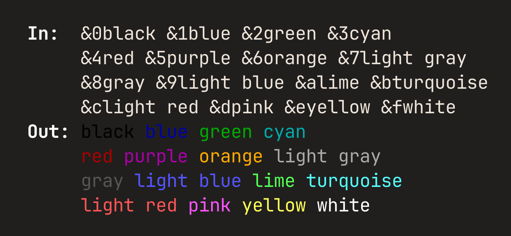

# Dahlia Specification

- [Introduction](#introduction)
- [Syntax](#syntax)
  - [Basic formatting](#basic-formatting)
  - [Custom colors](#custom-colors)
  - [Background colors](#background-colors)
  - [Escaping](#escaping)
  - [Resetting](#resetting)
- [Formatting Reference](#formatting-reference)
  - [ANSI Templates](#ansi-templates)
  - [ANSI Color Codes](#ansi-color-codes)
  - [ANSI Style Codes](#ansi-style-codes)
  - [ANSI Reset Codes](#ansi-reset-codes)
- [API](#api)
  - [Constructor parameters](#constructor-parameters)
    - [`auto_reset`](#auto_reset)
    - [`depth`](#depth)
    - [`marker`](#marker)
  - [Target language consistency](#target-language-consistency)
  - [Environment variables](#environment-variables)
    - [`NO_COLOR`](#no_color)
    - [`TERM` and `COLORTERM`](#term-and-colorterm)
  - [Utility functions](#utility-functions)
    - [`clean`](#clean)
    - [`clean_ansi`](#clean_ansi)
    - [`showcase`](#showcase)


## Introduction

`Welcome to &1Dahlia&r!` → `Welcome to \x1b[34mDahlia\x1b[0m!`

This document describes the Dahlia library implementation specification in
certain languages.

The key words "MUST", "MUST NOT", "REQUIRED", "SHALL", "SHALL NOT", "SHOULD",
"SHOULD NOT", "RECOMMENDED", "MAY", and "OPTIONAL" in this document are to be
interpreted as described in [RFC 2119](https://tools.ietf.org/html/rfc2119).


## Syntax

### Basic formatting
Dahlia formatting is done by using a marker (`&` by default) and codes (either
[color](#ansi-color-codes) or [style](#ansi-style-codes)) from the list below.
All codes are 1-character long.




### Custom colors
Any color can be used by using the `&#XXXXXX;` syntax, where `XXXXXX` is a
6-digit hexadecimal code. Shorthand codes like `&#09c;` (equivalent to
`&#0099cc;`) are allowed.


### Background colors
All colors can be applied to the background instead of the text by appending a
`~` to the marker. For instance, `&~4` sets a red background.


### Escaping

The underscore serves as an escape code for Dahlia: `&_` gets converted to `&`.


### Resetting
Applied formatting can be removed by using [reset codes](#ansi-reset-codes).
`&R` resets all formatting, while `&r` codes reset specific formats, e.g. `&rl`
removes the bold formatting.


## Formatting Reference

### ANSI Templates

Category      | Foreground           | Background
---           | ---                  | ---
text styles   | `ESC[{}m`            | `ESC[{}m`
3-bit colors  | `ESC[{}m`            | `ESC[{}m`
4-bit colors  | `ESC[{}m`            | `ESC[{}m`
8-bit colors  | `ESC[38;5;{}m`       | `ESC[48;5;{}m`
24-bit colors | `ESC[38;2;{};{};{}m` | `ESC[48;2;{};{};{}m`


### ANSI Color Codes

Name       | Dahlia | ANSI 3-bit | ANSI 4-bit | ANSI 8-bit | RGB             | HEX
:---       | :---:  | :---:      | :---:      | :---:      | :---:           | :---
Black      | 0      | 30         | 30         | 0          | (0, 0, 0)       | #000000
Blue       | 1      | 34         | 34         | 19         | (0, 0, 170)     | #0000aa
Green      | 2      | 32         | 32         | 34         | (0, 170, 0)     | #00aa00
Cyan       | 3      | 36         | 36         | 37         | (0, 170, 170)   | #00aaaa
Red        | 4      | 31         | 31         | 124        | (170, 0, 0)     | #aa0000
Purple     | 5      | 35         | 35         | 127        | (170, 0, 170)   | #aa00aa
Orange     | 6      | 33         | 33         | 214        | (255, 170, 0)   | #ffaa00
Light gray | 7      | 37         | 37         | 248        | (170, 170, 170) | #aaaaaa
Gray       | 8      | 30         | 90         | 240        | (85, 85, 85)    | #555555
Light blue | 9      | 34         | 94         | 147        | (85, 85, 255)   | #5555ff
Lime       | a      | 32         | 92         | 83         | (85, 255, 85)   | #55ff55
Turqoise   | b      | 34         | 96         | 87         | (85, 255, 255)  | #55ffff
Light red  | c      | 31         | 91         | 203        | (255, 85, 85)   | #ff5555
Pink       | d      | 35         | 95         | 207        | (255, 85, 255)  | #ff55ff
Yellow     | e      | 33         | 93         | 227        | (255, 255, 85)  | #ffff55
White      | f      | 37         | 97         | 15         | (255, 255, 255) | #ffffff


### ANSI Style Codes

Name          | Dahlia | ANSI
:---          | :---:  | :---:
Hidden        | h      | 8
Inverse       | i      | 7
Dim           | j      | 2
Blinking      | k      | 5
Bold          | l      | 1
Strikethrough | m      | 9
Underline     | n      | 4
Italic        | o      | 3


### ANSI Reset Codes

Reset kind    | Dahlia | ANSI
:---          | :---:  | :---:
Full          | `R`    | 0
Foreground    | `rf`   | 39
Background    | `rb`   | 49
Color         | `rc`   | 39 and 49
Hidden        | `rh`   | 28
Inverse       | `ri`   | 27
Dim           | `rj`   | 22
Blinking      | `rk`   | 25
Bold          | `rl`   | 22
Strikethrough | `rm`   | 29
Underline     | `rn`   | 24
Italic        | `ro`   | 23


## API

For object-oriented languages (and those capable of implementing an equivalent
model, e.g. Rust with `struct` + `impl`):
```ts
enum Depth {
    Tty = 3,
    Low = 4,
    Medium = 8,
    High = 24
}
type DepthString = "tty" | "low" | "medium" | "high"
type DepthInt = 3 | 4 | 8 | 24


class Dahlia {
    constructor(
        depth: Depth | DepthString | DepthInt = Depth.Low,
        noReset: boolean = false,
        noColor: boolean? = null,
        marker: char = '&'
    ) {}

    convert(str: string): string {}
    input(prompt: string): string {}
    print(...) {}
    reset() {}
    test() {}
}
```

`Dahlia` instances SHOULD be:
- hashable
- comparable: using `depth`, `no_reset` and `marker` values
- printable: preferably in a way that produces valid syntax, e.g.:
  - Python: `Dahlia(depth=Depth.HIGH, no_reset=False, marker='&')`  
  - Swift: `Dahlia(depth: Depth.high, no_reset: false, marker: '&')`

Target languages CAN provide default parameter values.
If they do, they SHOULD stick to defaults in the above code block.

---

Other languages MUST implement the following functions:

Method           | Function
:---:            | :---:
`Dahlia.convert` | `dahlia`
`Dahlia.print`   | `dprint`
`Dahlia.input`   | `dinput`

```ts
function dahlia(
  str: string,
  depth: Depth | DepthString | DepthInt = Depth.LOW,
  noReset: boolean = false,
  noColor: boolean? = null
): string {}

function dprint(
  ...,
  depth: Depth | DepthString | DepthInt = Depth.LOW,
  noReset: boolean = false,
  noColor: boolean? = null,
  ...
) {}

function dinput(
  prompt: string,
  depth: Depth | DepthString | DepthInt = Depth.LOW,
  noReset: boolean = false,
  noColor: boolean? = null
): string {}
```

Just like with the OO approach, target languages CAN provide default parameter
values. If they do, they SHOULD stick to defaults in the above code block.

### Constructor parameters

#### `auto_reset`

The `auto_reset` parameter specifies whether the full-reset code (`\033[0m`;
`&R` by default) should be automatically appended to the end of the string if
not present yet. It MUST be a boolean value and SHOULD default to `true`.

#### `depth`

The `depth` parameter refers to color depth (2³, 2⁴, 2⁸ or 2²⁴ colors). All
four depths MUST be supported.

At least one of the following data types SHOULD be allowed to represent the
depth:
* enum members
    ```rs
    enum Depth {
      TTY     // 3-bit
      LOW     // 4-bit
      MEDIUM  // 8-bit
      HIGH    // 24-bit
    }
    ```
* strings (one of `"tty"`, `"low"`, `"medium"`, `"high"`)
* integers (one of `3`, `4`, `8`, `24`)

This parameter SHOULD be as flexible as possible and so implementations SHOULD
allow mixing these types (e.g. `Dahlia(depth: Depth.HIGH)` or
`Dahlia(depth: "high")` SHOULD both be allowed and mean the same thing). If the
target language only allows one data type as input, the preference is enums >
integers > strings (or integers > strings if enums don't exist or are
inconvenient to use in the target language).

By default, the depth SHOULD be automatically determined based on the
[`TERM` and `COLORTERM` environment variables](#term-and-colorterm). This
behavior (and thus the default value) SHOULD be represented by a `None` value if
one can be supplied in the target language (e.g. through a type union or an
option type). Otherwise, the aforementioned data types MUST accept an additional
`Depth.AUTO`, `"auto"`, or `0` value, respectively.

#### `marker`

The `marker` parameter specifies the character used to mark the beginning of a
Dahlia formatting code. It MUST be a single character and SHOULD default to `&`.

### Target language consistency

To feel native and intuitive within the context of respective programming
languages, Dahlia implementations SHOULD aim to align with the conventions of
and built-in solutions provided by the target language.

For example, when implementing the `print` method/function in Python, it SHOULD
accept `end`, `file`, `flush`, and `sep` parameters so that it's easier to move
from the built-in `print` function.

Similarly, languages providing multiple variants of print functions (e.g.
`print`, `println`, `printf`) SHOULD have them mirrored in the Dahlia
implementation (cf. [`dahlia-rs`](https://github.com/dahlia-lib/dahlia-rs) with
its `dprint!` and `dprintln!` macros).

Finally, all identifiers SHOULD follow the naming conventions of the target
language. For instance, the utility function [`clean_ansi`](#clean_ansi) should
be named `cleanAnsi` when implemented in Java, since functions use `camelCase`
there by convention. In cases where there's no prevalent style guide, you're
free to pick the style you find most fitting.

### Environment variables

#### `NO_COLOR`

All implementations MUST comply with [the `NO_COLOR` standard](https://no-color)
and support its environment variable. A simple way to implement it is to use
the [`clean` utility function](#clean):

```rs
// pseudocode

fn convert(self: Dahlia, string: String) -> String {
    if no_color {
        return utils::clean(string);
    }
    // actual processing
}
```

#### `TERM` and `COLORTERM`

### Utility functions

#### `clean`

The `clean(string)` utility function MUST strip away all Dahlia codes from a
string, except for the `&_` escape code which MUST be processed as usual:
```rs
clean("&_4 gives &4red")
// -> "&4 gives red"
```

#### `clean_ansi`

The `clean_ansi(string)` utility function MUST strip away all ANSI codes from a
string:
```rs
clean_ansi("\x1b[34mDahlia\x1b[0m")
// -> Dahlia
```
The following regex can be used to match ANSI codes:
<!--
Taken from ansi-regex, which is licensed as follows:

MIT License

Copyright (c) Sindre Sorhus <sindresorhus@gmail.com> (https://sindresorhus.com)

Permission is hereby granted, free of charge, to any person obtaining a copy of
this software and associated documentation files (the "Software"), to deal in
the Software without restriction, including without limitation the rights to
use, copy, modify, merge, publish, distribute, sublicense, and/or sell copies of
the Software, and to permit persons to whom the Software is furnished to do so,
subject to the following conditions:

The above copyright notice and this permission notice shall be included in all
copies or substantial portions of the Software.

THE SOFTWARE IS PROVIDED "AS IS", WITHOUT WARRANTY OF ANY KIND, EXPRESS OR
IMPLIED, INCLUDING BUT NOT LIMITED TO THE WARRANTIES OF MERCHANTABILITY, FITNESS
FOR A PARTICULAR PURPOSE AND NONINFRINGEMENT. IN NO EVENT SHALL THE AUTHORS OR
COPYRIGHT HOLDERS BE LIABLE FOR ANY CLAIM, DAMAGES OR OTHER LIABILITY, WHETHER
IN AN ACTION OF CONTRACT, TORT OR OTHERWISE, ARISING FROM, OUT OF OR IN
CONNECTION WITH THE SOFTWARE OR THE USE OR OTHER DEALINGS IN THE SOFTWARE.

Source: https://github.com/chalk/ansi-regex/blob/main/index.js
-->
```regex
[\u001B\u009B][\[\]()#;?]*(?:(?:(?:(?:;[-a-zA-Z\d\/#&.:=?%@~_]+)*|[a-zA-Z\d]+(?:;[-a-zA-Z\d\/#&.:=?%@~_]*)*)?\u0007)|(?:(?:\d{1,4}(?:;\d{0,4})*)?[\dA-PR-TZcf-nq-uy=><~]))
```

#### `showcase`