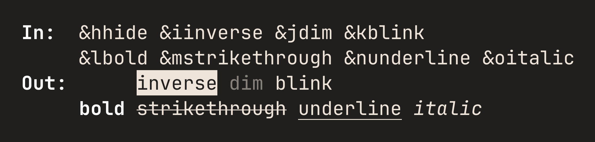
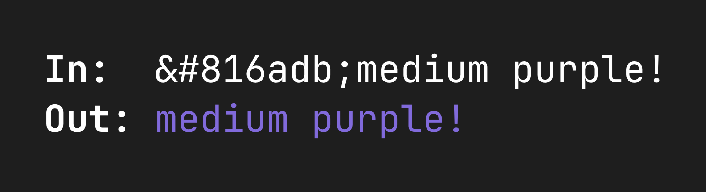
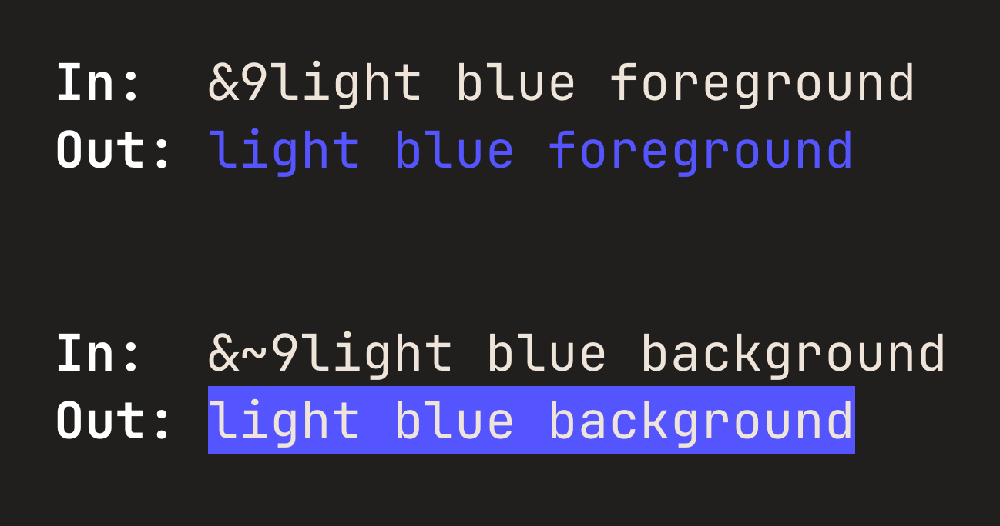
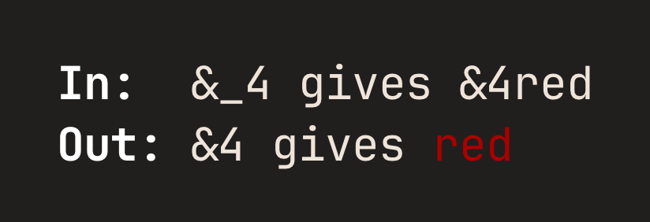
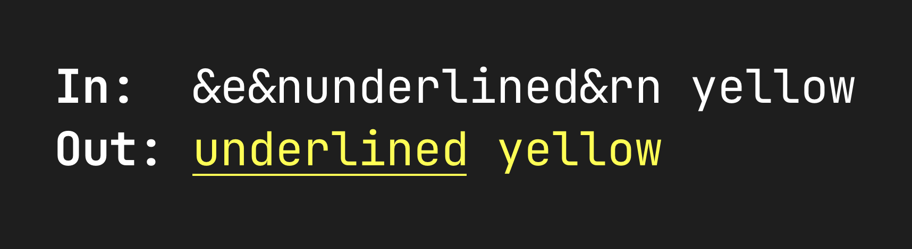

# Dahlia Specification v1.2.0

- [Introduction](#introduction)
- [Glossary](#glossary)
- [Syntax](#syntax)
  - [Standard formatting](#standard-formatting)
  - [Arbitrary hex colors](#arbitrary-hex-colors)
  - [Background colors](#background-colors)
  - [Escaping](#escaping)
  - [Resetting](#resetting)
- [API](#api)
  - [Constructor parameters](#constructor-parameters)
    - [`depth`](#depth)
    - [`marker`](#marker)
    - [`auto_reset`](#auto_reset)
  - [Target language consistency](#target-language-consistency)
  - [Environment variables](#environment-variables)
    - [`NO_COLOR`](#no_color)
    - [`TERM` and `COLORTERM`](#term-and-colorterm)
  - [Utility functions](#utility-functions)
    - [`clean`](#clean)
    - [`clean_ansi`](#clean_ansi)
- [Formatting Reference](#formatting-reference)
  - [ANSI Templates](#ansi-templates)
  - [ANSI Color Codes](#ansi-color-codes)
  - [ANSI Style Codes](#ansi-style-codes)
  - [ANSI Reset Codes](#ansi-reset-codes)


## Introduction

`Welcome to &2Dahlia&R!` → `Welcome to \x1b[32mDahlia\x1b[0m!`

This document describes the Dahlia library implementation specification. Dahlia
is a text formatting library for the terminal, which performs string
replacements by scanning text for Dahlia's special codes and transforms them
into standardized ANSI control sequences for coloring and font styling. Drawing
inspiration from the formatting techniques in the game Minecraft, Dahlia is
crafted with comfort and conciseness in mind.

The key words "MUST", "MUST NOT", "REQUIRED", "SHALL", "SHALL NOT", "SHOULD",
"SHOULD NOT", "RECOMMENDED", "MAY", and "OPTIONAL" in this document are to be
interpreted as described in [RFC 2119](https://tools.ietf.org/html/rfc2119).

Any words in bold are to be interpreted as defined in the [Glossary](#glossary).

You're welcome to freely extend your implementation upon complying with this 
specification.


## Glossary

**color depth**\
The number of colors supported by a terminal emulator. This may be one of:
* 2¹ (2) colors (no color)
* 2³ (8) colors (common in TTYs)
* 2⁴ (16) colors
* 2⁸ (256) colors
* 2²⁴ colors (true color).

**method**\
A unit of functionality that is associated with a **record**. This may either be
a function taking the **record** as its first argument or a method of a class.

**record**\
A unit holding information about a Dahlia instance. Depending on the target
language, this may either be a struct or a class.

**transform** (verb)\
The process of converting a string with Dahlia codes to a string with ANSI
codes. This includes stripping them away if the [`NO_COLOR`](#no_color)
environment variable is set as well as handling [the escape code](#escaping).


## Syntax

> [!note]
> This section mainly serves as a user guide for the formatting rather than an
> implementation reference. However, ALL rules explained in this section are
> REQUIRED to be part of any implementation.


### Standard formatting

Standard Dahlia formatting is done by using a marker (`&` by default) followed
by a [color](#ansi-color-codes)/[style](#ansi-style-codes) code from the list
below. All standard color and style codes are 1-character long.

<!--
In:  &0black &1blue &2green &3cyan
     &4red &5purple &6orange &7light gray
     &8gray &9light blue &alime &bturquoise
     &clight red &dpink &eyellow &fwhite
Out: black blue green cyan
     red purple orange light gray
     gray light blue lime turquoise
     light red pink yellow white
-->

<!--
In:  &hhide &iinverse &jdim &kblink
     &lbold &mstrikethrough &nunderline &oitalic
Out: hide inverse dim blink
     bold strikethrough underline italic
-->


> [!important]
> The second image omits reset codes for brevity (the output would actually have
> the styles stacked). To achieve the same output, the input would have to be:
> ```
> &hhide&R &iinverse&R &jdim&R &kblink&R
> &lbold&R &mstrikethrough&R &nunderline&R &oitalic
> ```


### Arbitrary hex colors

Any color can be used by using the `&#XXXXXX;` syntax, where `XXXXXX` is a
6-digit hexadecimal code. Shorthand codes like `&#09c;` (equivalent to
`&#0099cc;`) are allowed.

<!--
In:  #&816adb;medium purple!
Out: medium purple!
-->



### Background colors

All colors can be applied to the background instead of the text by appending a
`~` to the marker. For instance, `&~4` sets a red background.

<!--
In:  &9light blue foreground
Out: light blue foreground

In:  &~9light blue background
Out: light blue background
-->



### Escaping

The underscore serves as an escape code for Dahlia: `&_` gets converted to `&`.

<!--
In:  &_4 gives &4red
Out: &4 gives red
-->



### Resetting

Applied formatting can be removed by using [reset codes](#ansi-reset-codes).
`&R` resets all formatting, while `&r` codes reset specific formats, e.g. `&rl`
removes the bold formatting.

<!--
In:  &e&nunderlined&rn yellow
Out: underlined yellow
-->



## API

The base **record** SHOULD be named `Dahlia` and SHALL accept the following
parameters in its constructor (in order):
* [`depth`](#depth)
* [`marker`](#marker)
* [`auto_reset`](#auto_reset)

The **methods** MUST include the following:
* `convert(string: String) -> String`: **transforms** a string based on the
  instance's settings
* `input(prompt: String) -> String`: **transforms** and prints the prompt, then
  reads a line from stdin
* `print(...)`: **transforms** and prints its input (for details on parameters
  see [Target language consistency](#target-language-consistency))


### Constructor parameters

#### `depth`

The `depth` parameter specifies the **color depth**. All specified depths MUST
be supported.

At least one of the following data types SHOULD be allowed to represent the
depth:
* enum members
    ```rs
    enum Depth {
      TTY     // 3-bit
      LOW     // 4-bit
      MEDIUM  // 8-bit
      HIGH    // 24-bit
    }
    ```
* strings (one of `"tty"`, `"low"`, `"medium"`, `"high"`, all case-insensitive)
* integers (one of `3`, `4`, `8`, `24`)

This parameter SHOULD be as flexible as possible and so implementations SHOULD
allow mixing these types (e.g. `Dahlia(depth: Depth.HIGH)` and
`Dahlia(depth: "high")` would both be allowed and mean the same thing). If the
target language only allows one data type as input, the preference is enums >
integers > strings (or integers > strings if enums don't exist or are
inconvenient to use in the target language).

By default, the depth SHOULD be automatically determined based on the
[`TERM` and `COLORTERM` environment variables](#term-and-colorterm). This
behavior (and thus the default value) MUST[^1] be represented by a null value if
one can be supplied in the target language (e.g. through a type union or an
option type). Otherwise, the aforementioned data types MUST accept an additional
`Depth.AUTO`, `"auto"`, or `0` value, respectively.

> [!warning]
> This specification does not cover handling arbitrary hex colors for
> non-truecolor depths. It is up to the implementation to either ignore the
> code, quantize it to a lower depth or let the terminal emulator handle it.


#### `marker`

The `marker` parameter specifies the character used to mark the beginning of a
Dahlia formatting code. It MUST be a single character and MUST[^1] default to
`&`.

> [!tip]
> If you're implementing Dahlia code matching using regular expressions, keep
> in mind that some markers will require escaping (i.e. any of `^$.|()[\\*+?`).

#### `auto_reset`

The `auto_reset` parameter specifies whether the full-reset code (`\033[0m`;
`&R` by default) should be automatically appended to the end of the string if
not present yet. It MUST be a boolean value and MUST[^1] default to true.

[^1]: Only applies to languages that allow default parameter values.


### Target language consistency

To feel native and intuitive within the context of respective programming
languages, Dahlia implementations SHOULD aim to align with the conventions of
and built-in solutions provided by the target language.

For example, when implementing the `print` **method** in Python, it SHOULD
accept `end`, `file`, `flush`, and `sep` parameters so that it's easier to move
from the built-in `print` function.

Similarly, languages providing multiple variants of print functions (e.g.
`print`, `println`, `printf`) SHOULD have them mirrored in the Dahlia
implementation (cf. [`dahlia-rs`](https://github.com/dahlia-lib/dahlia-rs) with
its `dprint!` and `dprintln!` macros).

Finally, all identifiers SHOULD follow the naming conventions of the target
language. For instance, the utility function [`clean_ansi`](#clean_ansi) SHOULD
be named `cleanAnsi` when implemented in Java, since functions use `camelCase`
there by convention. In cases where there's no prevalent style guide, you're
free to pick the style you find most fitting.


### Environment variables

#### `NO_COLOR`

All implementations MUST comply with [the `NO_COLOR` standard](https://no-color)
and support its environment variable. A simple way to implement it is to use
the [`clean` utility function](#clean):

```rs
// pseudocode

fn convert(self: Dahlia, string: String) -> String {
    if no_color {
        return clean(string);
    }
    // actual processing
}
```


#### `TERM` and `COLORTERM`

When `depth` is set to auto, the `TERM` and `COLORTERM` environment variables
SHOULD be used to determine the color depth. The following values SHOULD be
recognized (as regexes):

##### `COLORTERM` (24-bit)
* `truecolor`
* `24bit`

##### `TERM`
* `dumb` → same as `NO_COLOR=1`
* anything containing `24-?bit` → `24-bit`
* `terminator` → `24-bit`
* `mosh` → `24-bit`
* anything containing `256` → `8-bit`

If none of the above match, the depth SHOULD default to `4-bit`.

Reading `COLORTERM` is preferred over `TERM` when set.


### Utility functions

#### `clean`

The `clean(string, marker)` utility function MUST strip away all Dahlia codes
from a string, except for the `&_` escape code which SHALL be processed as
usual. The `marker` parameter MUST follow the same rules as the regular
[`marker`](#marker) parameter. `clean` MAY be a **method** of the
Dahlia **record** instead of a standalone function.
```rs
clean("&_4 gives &4red")
// -> "&4 gives red"
clean("&4 gives §4red", marker="§")
// -> "&4 gives red"
```


#### `clean_ansi`

The `clean_ansi(string)` utility function MUST strip away all ANSI codes from a
string:
```rs
clean_ansi("\x1b[34mDahlia\x1b[0m")
// -> Dahlia
```
The following regex can be used to match ANSI codes:
<!--
Taken from ansi-regex, which is licensed as follows:

MIT License

Copyright (c) Sindre Sorhus <sindresorhus@gmail.com> (https://sindresorhus.com)

Permission is hereby granted, free of charge, to any person obtaining a copy of
this software and associated documentation files (the "Software"), to deal in
the Software without restriction, including without limitation the rights to
use, copy, modify, merge, publish, distribute, sublicense, and/or sell copies of
the Software, and to permit persons to whom the Software is furnished to do so,
subject to the following conditions:

The above copyright notice and this permission notice shall be included in all
copies or substantial portions of the Software.

THE SOFTWARE IS PROVIDED "AS IS", WITHOUT WARRANTY OF ANY KIND, EXPRESS OR
IMPLIED, INCLUDING BUT NOT LIMITED TO THE WARRANTIES OF MERCHANTABILITY, FITNESS
FOR A PARTICULAR PURPOSE AND NONINFRINGEMENT. IN NO EVENT SHALL THE AUTHORS OR
COPYRIGHT HOLDERS BE LIABLE FOR ANY CLAIM, DAMAGES OR OTHER LIABILITY, WHETHER
IN AN ACTION OF CONTRACT, TORT OR OTHERWISE, ARISING FROM, OUT OF OR IN
CONNECTION WITH THE SOFTWARE OR THE USE OR OTHER DEALINGS IN THE SOFTWARE.

Source: https://github.com/chalk/ansi-regex/blob/main/index.js
-->
```regex
[\u001B\u009B][\[\]()#;?]*(?:(?:(?:(?:;[-a-zA-Z\d\/#&.:=?%@~_]+)*|[a-zA-Z\d]+(?:;[-a-zA-Z\d\/#&.:=?%@~_]*)*)?\u0007)|(?:(?:\d{1,4}(?:;\d{0,4})*)?[\dA-PR-TZcf-nq-uy=><~]))
```


## Formatting Reference

### ANSI Templates

Category      | Foreground           | Background
---           | ---                  | ---
text styles   | `ESC[{}m`            | `ESC[{}m`
3-bit colors  | `ESC[{}m`            | `ESC[{}m`
4-bit colors  | `ESC[{}m`            | `ESC[{}m`
8-bit colors  | `ESC[38;5;{}m`       | `ESC[48;5;{}m`
24-bit colors | `ESC[38;2;{};{};{}m` | `ESC[48;2;{};{};{}m`


### ANSI Color Codes

Name       | Dahlia | ANSI 3-bit | ANSI 4-bit | ANSI 8-bit | RGB             | HEX
:---       | :---:  | :---:      | :---:      | :---:      | :---:           | :---
Black      | `0`    | 30         | 30         | 0          | (0, 0, 0)       | `#000000`
Blue       | `1`    | 34         | 34         | 19         | (0, 0, 170)     | `#0000aa`
Green      | `2`    | 32         | 32         | 34         | (0, 170, 0)     | `#00aa00`
Cyan       | `3`    | 36         | 36         | 37         | (0, 170, 170)   | `#00aaaa`
Red        | `4`    | 31         | 31         | 124        | (170, 0, 0)     | `#aa0000`
Purple     | `5`    | 35         | 35         | 127        | (170, 0, 170)   | `#aa00aa`
Orange     | `6`    | 33         | 33         | 214        | (255, 170, 0)   | `#ffaa00`
Light gray | `7`    | 37         | 37         | 248        | (170, 170, 170) | `#aaaaaa`
Gray       | `8`    | 30         | 90         | 240        | (85, 85, 85)    | `#555555`
Light blue | `9`    | 34         | 94         | 147        | (85, 85, 255)   | `#5555ff`
Lime       | `a`    | 32         | 92         | 83         | (85, 255, 85)   | `#55ff55`
Turqoise   | `b`    | 34         | 96         | 87         | (85, 255, 255)  | `#55ffff`
Light red  | `c`    | 31         | 91         | 203        | (255, 85, 85)   | `#ff5555`
Pink       | `d`    | 35         | 95         | 207        | (255, 85, 255)  | `#ff55ff`
Yellow     | `e`    | 33         | 93         | 227        | (255, 255, 85)  | `#ffff55`
White      | `f`    | 37         | 97         | 15         | (255, 255, 255) | `#ffffff`


### ANSI Style Codes

Name          | Dahlia | ANSI
:---          | :---:  | :---:
Hidden        | `h`    | 8
Inverse       | `i`    | 7
Dim           | `j`    | 2
Blinking      | `k`    | 5
Bold          | `l`    | 1
Strikethrough | `m`    | 9
Underline     | `n`    | 4
Italic        | `o`    | 3


### ANSI Reset Codes

Reset kind    | Dahlia | ANSI
:---          | :---:  | :---:
Full          | `R`    | 0
Foreground    | `rf`   | 39
Background    | `rb`   | 49
Color         | `rc`   | 39 and 49
Hidden        | `rh`   | 28
Inverse       | `ri`   | 27
Dim           | `rj`   | 22
Blinking      | `rk`   | 25
Bold          | `rl`   | 22
Strikethrough | `rm`   | 29
Underline     | `rn`   | 24
Italic        | `ro`   | 23
